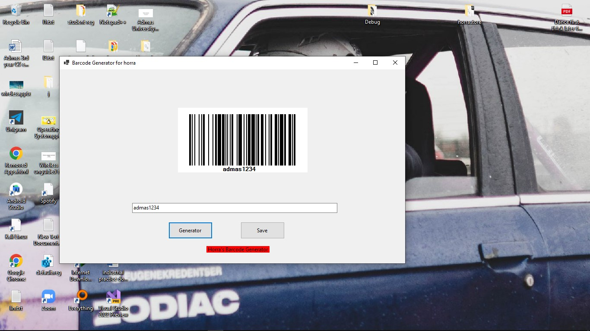

# Horra Foods Barcode Generator

## Introduction
The Horra Foods Barcode Generator is a custom-made application developed in C# to streamline the barcode generation process for the Horra Foods factory. This application allows users to generate high-quality barcodes for the company's products, ensuring accurate and efficient inventory management and product tracking.

## Features
- **Barcode Generation**: The application supports the generation of various barcode types, including Code 39, Code 128, EAN-13, and UPC-A.
- **Customization**: Users can customize the barcode settings, such as the barcode size, resolution, and color, to match the specific requirements of the Horra Foods packaging.
- **Batch Processing**: The application allows users to generate barcodes in batches, saving time and improving efficiency.
- **Integration**: The generated barcodes can be easily integrated into the Horra Foods inventory management system, ensuring seamless data transfer and tracking.
- **User-Friendly Interface**: The application's intuitive user interface makes it easy for Horra Foods employees to use and navigate.
## Screenshots

## Usage
1. Launch the Horra Foods Barcode Generator application.
2. Select the desired barcode type and customize the settings as needed.
3. Enter the product information or import a CSV file with the necessary data.
4. Click the "Generate Barcodes" button to create the barcodes.
5. The generated barcodes can be saved as image files or directly integrated into the Horra Foods inventory management system.

## Troubleshooting
If you encounter any issues while using the Horra Foods Barcode Generator, please refer to the following troubleshooting steps:

1. Ensure that you have the latest version of the .NET Framework installed on your system.
2. Check the application logs for any error messages or warnings.
3. Verify that the input data is in the correct format and that the application settings are configured correctly.
4. If the issue persists, please contact the Horra Foods IT support team for further assistance.

## Contributing
If you find any bugs, have suggestions for new features, or would like to contribute to the codebase, please feel free to open a new issue or submit a pull request.

